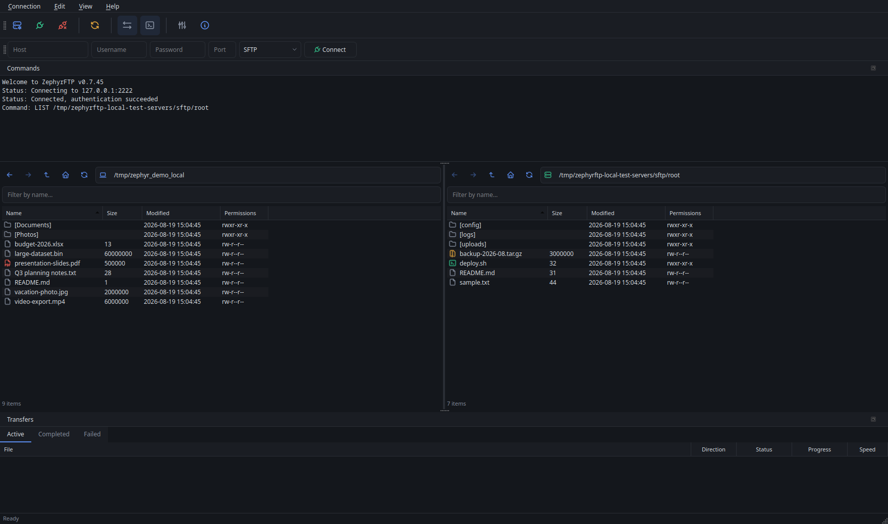
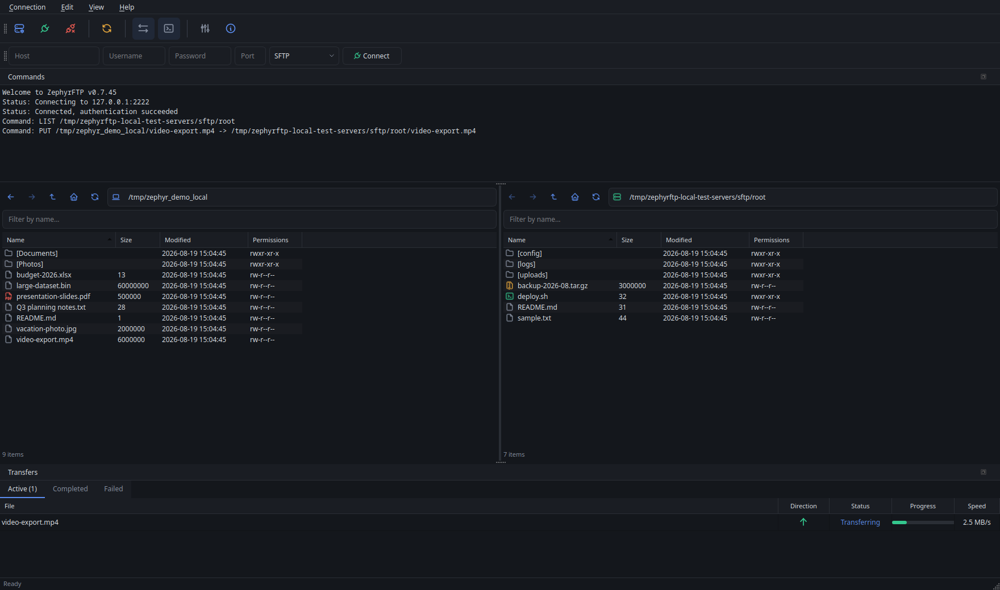

# ZephyrFTP

A dual-pane SFTP client for Windows and Linux — browse your local files
and a remote server side by side, then drag, drop, or double-click to
move things between them. Think FileZilla or WinSCP, built fresh in Qt6.

**Current version: 0.6.21 — alpha.** Real functionality, but real gaps
too — see [Known limitations](#known-limitations) before relying on
this for anything you can't afford to get wrong. [Releases](https://github.com/arelas/zephyrftp/releases)
has downloadable Windows and Linux builds; [CHANGELOG.md](CHANGELOG.md)
tracks what's changed between them.

## Features

- **Dual-pane browsing** — your computer, a server, or two servers at
  once, side by side. Either pane can connect independently (click its
  own path-bar icon), so you're not limited to "your computer on one
  side, a server on the other" — connect both panes to different servers
  and transfer between them directly. Back, forward, and up buttons
  beside each pane's location bar, same as any file manager.
- **File management from the right-click menu** — create a new file or
  folder, rename, or delete, on either side (your computer or the
  server). Delete works on multiple selected items at once, with a
  confirmation first. Deleting a folder only works if it's empty —
  there's no "delete everything inside it too" here, on purpose, so a
  misclick can't wipe out more than you meant to remove.
- **SFTP with password or private-key login.**
- **Site Manager** — save connections you use often, organized into
  folders (type a new folder name right on the site's details, or pick
  an existing one from the dropdown), so you don't have to re-type the
  host, port, and username every time. Each saved site can also default
  to a specific starting folder on the server instead of your home
  directory — handy if you always go straight to the same upload folder.
  Your password (or a private key's passphrase) is never written to
  ZephyrFTP's own config file — you'll always still be asked for it when
  you connect. Check "Save password" and it's remembered for next time
  using your operating system's own secure credential storage (the same
  kind of protected store your browser or system keychain uses, not a
  plain file this app controls) — that prompt still appears every time,
  just pre-filled, so it's never a silent auto-connect. Leave the box
  unchecked and nothing changes from before.
- **Host-key verification** — the first time you connect to a server,
  ZephyrFTP shows you its identity fingerprint and asks you to confirm
  it. If that fingerprint ever changes on a later connection, you get a
  clear warning instead of a silent, invisible risk. This is the same
  protection SSH itself uses, and it's on by default here.
- **Certificate verification for FTPS**, the same trust-on-first-use idea
  as host-key verification above — the first time you connect to a
  server whose certificate can't be automatically verified (a self-signed
  one, for example), you're shown its fingerprint and asked to trust it.
  That decision is remembered for next time, and you get a clear warning
  if the certificate ever changes.
- **Drag-and-drop or multi-select transfers — whole folders too, not just
  files.** Drag a folder from one pane to the other (or select several,
  mixing files and folders freely) and everything inside gets recreated
  on the other side, nested structure and all, including empty
  subfolders. Each file inside shows up in the transfer queue like any
  other transfer — same pause/resume/cancel, same progress and speed.
- **Move, not just copy, when both panes are on the same server (or both
  on your computer).** Right-click a selection and choose "Move Selected"
  to relocate it server-side — a single instant rename, not a
  download-then-upload — instead of the usual Transfer/drag copy. Works
  for whole folders too. Only offered between two panes that are
  genuinely on the same connection; otherwise you'll see a short message
  explaining why, rather than the option silently doing nothing.
- **You're asked before anything gets overwritten.** If a file already
  exists at the destination, you'll be asked to Overwrite or Skip it —
  with a checkbox to apply that answer to everything else in the same
  batch, so you're not clicking through a dialog for every file. Folders
  work the same way: if a folder with that name already exists, you
  choose to write into it (merging with what's already there) or skip it
  entirely.
- **A real transfer queue** — see what's moving and how fast, pause a
  transfer to a server and pick it back up later without starting over,
  cancel something outright, or retry something that failed, all from
  one place.
- **A live Commands pane** — a real-time, read-only log of protocol
  traffic for both panes, modeled on FileZilla's own message log, docked
  between the toolbar and the file panes by default.
- **Click a column header to sort, click it again to reverse** — Name,
  Size, Modified, or Permissions on the file panes; File, Direction,
  Status, Progress, or Speed on the transfer queue. File panes default to
  folders first, then name descending; the transfer queue defaults to the
  order things were added.
- **Dark theme**, built around a small set of colors that mean the same
  thing everywhere in the app (green = connect/upload/success, red =
  disconnect/delete/error, blue = navigation/download, amber = caution)
  so you can read the state of things at a glance.
- **Preferences** (Edit menu) — a "Show hidden files" toggle for both
  panes, a default protocol for new connections, and whether the
  Transfers and Commands panes should be visible on start (both default
  to yes). Window size and panel layout (including either dock, if
  you've moved, resized, or detached it) are also remembered across
  restarts now, with no setting required.

## Download

Grab the latest build from [Releases](https://github.com/arelas/zephyrftp/releases):

- **Windows**: `zephyrftp-windows-x64.zip` — unzip it, no installer, just
  launch `zephyrftp.exe`.
- **Linux**: four options.
  - `zephyrftp_<version>_amd64.deb` — Debian/Ubuntu, `apt install
    ./zephyrftp_*.deb` resolves dependencies automatically.
  - `zephyrftp-<version>-1.x86_64.rpm` — Fedora/openSUSE/RHEL-family,
    `dnf install ./zephyrftp-*.rpm` (or your distro's equivalent).
  - `zephyrftp-linux-x64.tar.gz` — extracts to a single `zephyrftp`
    binary, no install/root needed, for anything else.

    These three are all dynamically linked against system Qt6/libssh2
    (not a bundled/portable build), so any of them needs those already
    installed (the exact packages CONTRIBUTING.md's build instructions
    use). If your distro doesn't have matching versions, use the
    AppImage below instead, or build from source (see
    [CONTRIBUTING.md](CONTRIBUTING.md)), which is quick on any recent
    distro.
  - `ZephyrFTP-<version>-x86_64.AppImage` — self-contained: Qt6,
    libssh2, and libsecret are all bundled, so no matching system
    packages are needed. `chmod +x` it and run it directly, no
    install/root/package-manager needed either. Only relies on the host
    for things every real desktop already has anyway (graphics drivers,
    fonts).

Every release is built and tested (the full automated test suite, not
just "it compiled") by [`.github/workflows/build.yml`](.github/workflows/build.yml)
before being attached — see ARCHITECTURE.md's "Windows and Linux builds
(CI)" section for exactly what that verifies.

## Getting started

1. **Launch the app.** The left pane shows your local files right away —
   ZephyrFTP works as a plain two-pane local file manager even before
   you connect to anything.
2. **Click Connect** in the toolbar (or the **Connection** menu) for a
   one-off connection — fill in the server's host, port (22 by default),
   your username, and either a password or a private key file. If it's a
   server you'll come back to, use **Sites** instead: same information,
   but saved for next time (a "New Site" button, and a tree on the left
   to organize them). The toolbar always connects the right pane; click
   either pane's own icon at the left edge of its path bar for the same
   Connect/Sites/Disconnect choices targeting that specific pane instead
   — this is how you connect the *left* pane, or get two servers
   connected at once for a server-to-server transfer.
3. **First connection to a new server?** You'll be asked to confirm its
   identity fingerprint. This is expected and normal — it's the same
   prompt any SSH client shows the first time. Confirming it once means
   ZephyrFTP will recognize that server automatically on future
   connections, and will warn you loudly if its identity ever changes.
4. **Browse and transfer.** Once connected, the right pane shows the
   remote server. Double-click a file to send it to the other pane, drag
   files between panes, or select several and right-click → "Transfer
   Selected."
5. **Watch the Transfers panel** at the bottom for progress and speed.
   Right-click any transfer to cancel it, pause it (server transfers
   only — see Known limitations), resume a paused one, or retry
   something that failed or that you skipped.

## Known limitations

This is young software — a few things intentionally aren't supported yet
rather than being half-implemented:

- **FTP and FTPS work against a real server, but only controlled local
  ones so far — not yet a production server out in the wild.** Connecting,
  browsing, and transferring files over plain FTP, active-mode fallback,
  the legacy `LIST` directory-listing fallback, and a full encrypted
  transfer over FTPS (including trusting a certificate and reusing that
  trust) have all been confirmed against real, independently-implemented
  FTP/FTPS server software (vsftpd and proftpd, not just this project's
  own test stand-in), not just tested in isolation. Still newer and less
  battle-tested than SFTP; expect some rough edges against servers this
  hasn't specifically been tried against.
- **Server-to-server transfers are now supported, but staged through a
  local temporary file rather than moving directly between the two
  servers.** Both panes can now connect independently — click either
  pane's own path-bar icon for a per-pane Connect/Sites/Disconnect menu,
  not just the toolbar's (which still targets the right pane, as a
  shortcut). Dragging or transferring a file between two connected
  servers downloads it to a temporary local file first, then uploads it
  to the destination — no protocol lets one server send a file straight
  to another, so this is the only mechanism possible. In practice this
  means roughly twice the transfer time of a direct copy, and briefly
  uses local disk space equal to the file's size. Verified against a
  real fake-backend orchestration test (direction/phase handling,
  temp-file cleanup on success and on cancellation during either half)
  and a real, automated, repeatable live-two-server test (`verify-remote-to-remote-live`,
  mirroring `verify-sftp-pause-cancel`'s pattern) confirming a real file
  transfers end to end between two genuinely independent local SFTP
  servers with the destination's content matching the source
  byte-for-byte — see ARCHITECTURE.md's `TransferManager` entry for the
  full detail.
- **Move can't merge into a folder that already exists at the
  destination.** A server-side rename can relocate a whole folder in one
  step, but it can't combine it with an existing folder of the same name
  the way a copy's "write into" can (transferring file by file) — if you
  choose to write into an existing folder for a Move, it fails with a
  clear explanation instead. Move a folder to a new name, or use the
  ordinary Transfer/drag copy if you need a real merge.
- **Pause only works for transfers involving a server.** You can pause an
  upload, a download, or a server-to-server transfer (either half) and
  pick it back up later. A purely local copy (between two folders on your
  own computer) can only be cancelled and retried, not paused, since
  there's nothing meaningful to interrupt mid-copy on a local transfer.

## For developers and tinkerers

Want to build it from source, understand how it works internally, or
contribute? Start with [CONTRIBUTING.md](CONTRIBUTING.md) for build/test
instructions, then [ARCHITECTURE.md](ARCHITECTURE.md) for the full
technical picture — what's been verified and how, the design of each
component, and every known gap in detail.

## License

GPL-3.0-or-later — see [LICENSE](LICENSE).

The vendored icon set (`resources/icons/`) is [Tabler Icons](https://tabler.io/icons),
MIT-licensed (a permissive license, fully compatible with being bundled
into a GPL project); its license text is included separately at
`resources/icons/LICENSE-tabler-icons.txt` since it's a distinct
copyright holder from this project, still under its own original terms.
